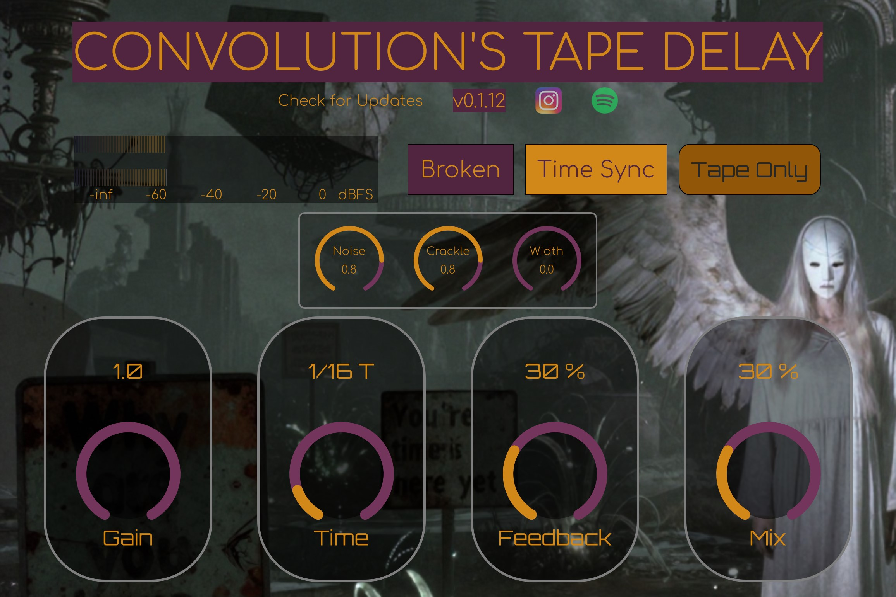

# Convolution's Tape Delay

This is a versatile Tape Delay VST3 plugin built with Rust, `nih-plug`, and `vizia`. It captures the character of vintage tape echo machines, ranging from clean, rhythmic repeats to warm, saturated, and wobbly textures.



## Features

The plugin is designed with a straightforward interface that balances modern control with analog-style imperfections.

### 1. Delay & Timing

This section controls the core delay line behavior.

- **Time:** Sets the delay time in milliseconds.
- **Time Sync:** When enabled, the **Time** knob snaps to musical subdivisions (e.g., 1/8, 1/4, 1/16 dotted) based on the host tempo.
- **Mix:** Blends between the dry input signal and the wet delay signal.
- **Feedback:** Controls the number of repeats. High settings can lead to self-oscillation.

### 2. Character & Texture (Tape Mojo)

This section introduces the non-linearities and artifacts that define the "tape" sound.

- **Broken:** A toggle that engages a "broken machine" mode. This introduces random dropouts, pitch instability, and mechanical noise, simulating a worn-out tape mechanism.
- **Tape Only:** When enabled, the plugin acts as a saturator and texturizer without the delay line (effectively setting delay time to 0 and feedback to 0). This allows you to use the plugin as a tape saturation effect.
- **Noise:** Adds continuous tape hiss to the signal path.
- **Crackle:** Introduces random static and vinyl-like crackle artifacts.
- **Ghost Zero:** A hidden parameter for future expansion.

### 3. Stereo & Width

- **Width:** Controls the stereo width of the delay repeats.
    - At `0%`, the delay is mono.
    - Increasing this value introduces time offsets and modulation differences between the left and right channels, creating a wide, spacious echo.

## Technical Implementation

- **Framework:** Built on `nih-plug`, a modern, Rust-native framework for creating audio plugins.
- **GUI:** The user interface is rendered using `vizia`, a declarative GUI toolkit for Rust that is part of the `nih-plug` ecosystem.
- **DSP:**
    - **Fractional Delay:** Uses linear interpolation for smooth delay time modulation.
    - **Tape Saturation:** Implements a soft-knee saturation curve (classic analog tape model) to add harmonic richness.
    - **Wow & Flutter:** Simulates tape speed fluctuations using a low-frequency oscillator (LFO).
    - **Corrosion:** An experimental "erosion" effect that uses phase-modulated delay lines to create metallic and degradation artifacts (active in "Broken" mode).
    - **Filters:** One-pole low-pass filters simulate the tone loss of repeated tape passes.

---

## Installation Guide

You can download the latest version from the [**Releases Page**](https://github.com/minburg/vst-tape-delay/releases).

### Windows (x64)

1.  Download the `.zip` file for Windows (e.g., `tape_delay-windows-x64.zip`).
2.  Extract the contents of the zip file. You will find a file named `tape_delay.vst3`.
3.  Move the `tape_delay.vst3` file into your VST3 plugins folder. The standard location is:
    ```
    C:\Program Files\Common Files\VST3\
    ```
4.  Rescan for plugins in your Digital Audio Workstation (DAW).

### macOS (Universal: Apple Silicon & Intel)

1.  Download the `.zip` file for macOS (e.g., `tape_delay-macos-universal.zip`).
2.  **Important:** Do **not** double-click to unzip. The standard macOS Archive Utility can sometimes fail to preserve necessary file permissions. Instead, open the **Terminal** app and use the `unzip` command:
    ```bash
    unzip /path/to/your/downloaded/tape_delay-macos-universal.zip
    ```
3.  This will create a `tape_delay.vst3` bundle. A VST3 on macOS is actually a folder that looks like a single file.
4.  Move the `tape_delay.vst3` bundle to your VST3 plugins folder. The standard location is:
    ```
    /Library/Audio/Plug-Ins/VST3/
    ```
    You can access this folder by opening Finder, clicking "Go" in the menu bar, selecting "Go to Folder...", and pasting the path.

#### **Bypassing Gatekeeper (Required for macOS)**
Because the plugin is not officially signed and notarized by Apple, you must manually approve it before your DAW will load it.

1.  After moving the file to the VST3 folder, open the **Terminal** app.
2.  Run the following command to remove the "quarantine" attribute that macOS automatically adds to downloaded files. This tells the system you trust the application.
    ```bash
    sudo xattr -rd com.apple.quarantine /Library/Audio/Plug-Ins/VST3/tape_delay.vst3
    ```
3.  Enter your password when prompted.
4.  Rescan for plugins in your DAW. The tape delay should now appear and load correctly.

---

## Build & Release Workflow

For those interested in the development process, the repository uses GitHub Actions to automate builds.

### Bundle & Zip Handling
The workflow ensures correct packaging for VST3 plugins across different operating systems.

- **Windows (x64):** Generates a `.vst3` file (renamed DLL) and zips it.
- **macOS (Universal):** Uses `zip -ry` to preserve symbolic links and executable permissions within the VST3 bundle structure, ensuring the plugin remains loadable after download.
